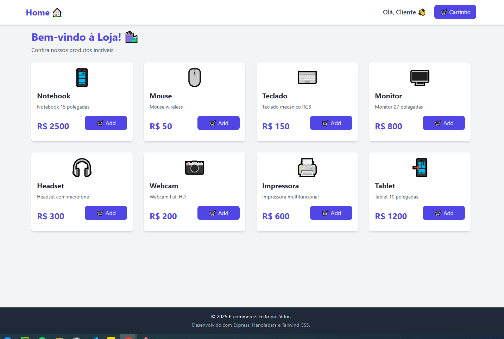
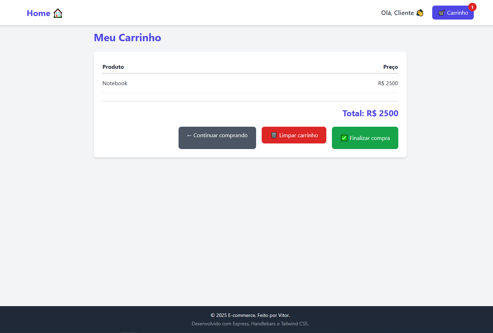

# 🛒 E-commerce Model — Roadmap de Evolução

## Introdução

#### Este projeto é um modelo simples de e-commerce desenvolvido com Node.js + Express + Handlebars, criado com o objetivo de estudo e aprimoramento.
Abaixo está um roadmap estruturado, organizado em etapas de evolução realistas, que mostram domínio técnico e maturidade no desenvolvimento.

  
  

---

## Roadmap simples para evolução gradual do projeto.

---

### Etapa 1 — MVP Funcional
- [x] Node.js + Express configurado
- [x] Handlebars (views, layouts e partials)
- [x] Arquivos estáticos
- [x] Lista de produtos mockados
- [x] Adicionar ao carrinho
- [x] Página do carrinho
- [x] Página 404

---

### Etapa 2 — Organização
- [ ] Separar rotas (`routes/`)
- [ ] Separar controladores (`controllers/`)
- [ ] Mover dados para `data/produtos.js`
- [ ] Criar middlewares
- [ ] Melhorar estrutura de pastas

---

### Etapa 3 — Banco de Dados
- [ ] Integrar SQLite ou MongoDB
- [ ] CRUD básico de produtos
- [ ] Carrinho persistente

---

### Etapa 4 — Autenticação
- [ ] Login e logout
- [ ] Sessões
- [ ] Proteger rotas

---

### Etapa 5 — Frontend
- [ ] Melhorar layout (Tailwind/Bootstrap)
- [ ] Página individual de produto
- [ ] Mensagens de feedback
- [ ] Responsividade aprimorada

---

### Etapa 6 — API
- [ ] Criar API REST para produtos
- [ ] Filtros e busca
- [ ] Consumir API no frontend

---

### Etapa 7 — Testes
- [ ] Testes unitários (Jest)
- [ ] Testes de integração (Supertest)

---

### Etapa 8 — Deploy
- [ ] Docker
- [ ] Deploy em Render / Railway
- [ ] Variáveis de ambiente

---

###  Etapa 9 — Documentação
- [ ] Screenshots
- [ ] GIF do funcionamento
- [ ] Descrição das rotas
- [ ] Passo a passo de instalação
